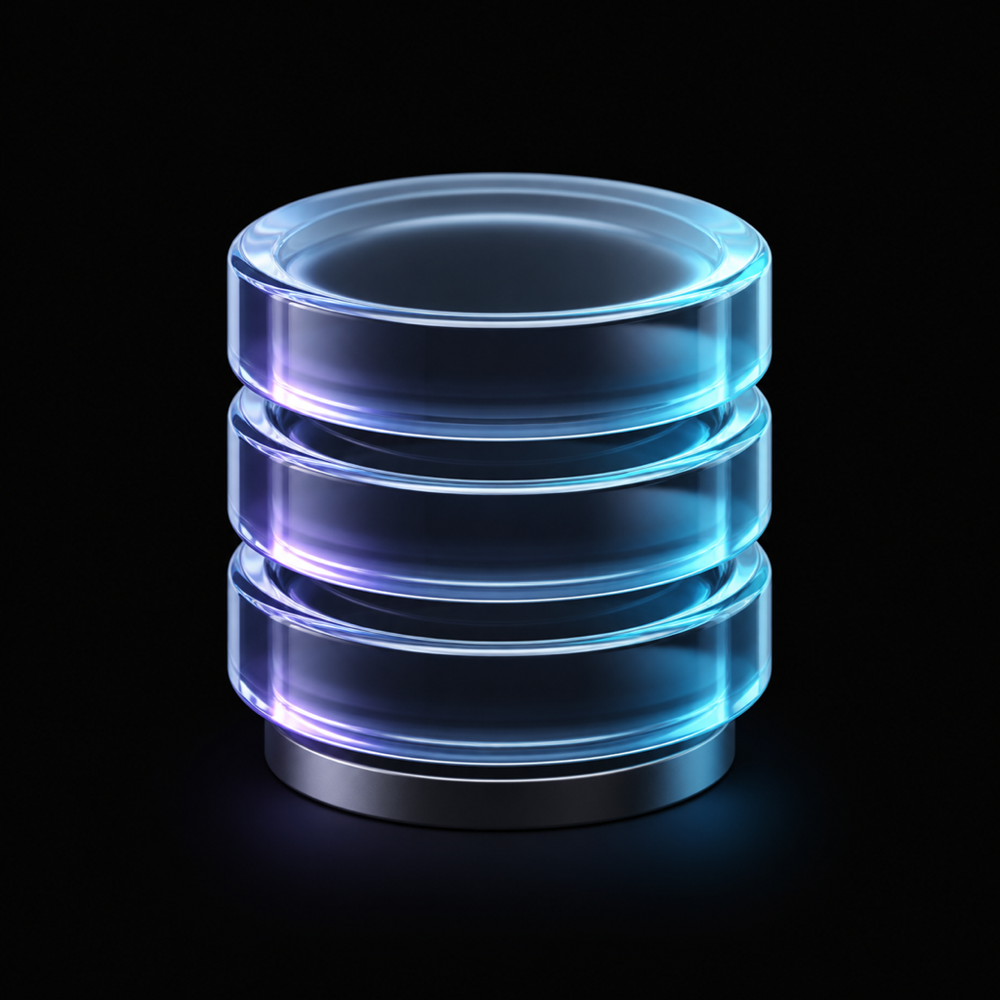

# glassdb

A native Apple-platform database client for iPhone, iPad, Apple silicon Mac, and Vision Pro. It combines adaptive SwiftUI workflows, a glass-first spatial workspace, and optional on-device AI with no AI cloud service.

**[glassdb.app](https://glassdb.app)** &nbsp;|&nbsp; **[Sponsor](https://github.com/sponsors/msitarzewski)**


---

## Why glassdb

glassdb uses one native SwiftUI target with purpose-built adaptations: compact single-window navigation on iPhone, a professional split-view and multiwindow data plane on iPad and Mac, and transparent spatial database workspaces with system ornaments on Vision Pro.

---

## Features

### Connection Management
- Save, organize, and color-tag database connections
- SSH tunneling with password or key authentication (Ed25519, RSA, and Secure Enclave-wrapped P256)
- Passwords and SSH keys stored in the system Keychain
- Compatible/exportable SSH key sharing with glas.sh via Keychain access groups
- Connection testing and state indicators

### Database Workspace
- DBeaver-style NavigationSplitView sidebar with database and table hierarchy
- Context-sensitive detail surface -- click a table, get a full multi-tab editor
- Click a database to see capability-supported properties and statistics
- Capability-gated context menus for database and table actions
- Row count badges in sidebar (lazy-loaded)
- Filter/search field for navigating large schemas
- Sidebar toggle for focused work

### Query Editor
- SQL syntax highlighting (keywords, functions, strings, numbers, comments, identifiers)
- Parser-backed statement selection and multi-statement execution
- Schema-aware completion, formatting, diagnostics, and capability-gated explain plans
- Multiple tabs plus native SQL document open/save; tabs retain text, selection, and latest result
- Persistent, searchable, privacy-aware query history and saved queries
- Configurable bounded results with explicit truncation status
- Keyboard shortcuts for statement and script execution

### Table Browser
- Capability-gated table detail tabs: **Data**, **Structure**, **DDL**, **Indexes**, and **Foreign Keys**
- Paginated data grid with configurable rows per page
- Row numbers that continue across pages
- Content-width columns with empty filler cells (spreadsheet-style)
- Sticky column headers via LazyVStack pinned views
- Column definitions with types, nullability, keys
- Syntax-highlighted DDL with copy button
- Index and foreign key inspection

### Record Editor
- TablePlus-style staging model -- edits are staged visually, not written immediately
- INSERT (add row) and UPDATE (edit row) support
- Type-specific input fields: text, JSON (with format/validate), booleans, dates, numbers
- NULL as placeholder text -- type to replace, button to set NULL
- Modified field indicators with change count
- Optimistic updates use stable identity plus original-row predicates

### AI Assistant (On-Device, Private; supported Foundation Models runtimes)
- **SQL Query Assistant**: Describe what you want in natural language, get a SQL query with risk assessment (safe/moderate/destructive)
- Uses privacy-bounded metadata for the currently selected table; row values are excluded by default
- Inserts generated SQL into the editor for review; deterministic app policy controls execution
- Powered by Foundation Models entirely on-device when available

### Data Export
- Export bounded query results or table data to CSV, JSON, or SQL; copy selected ranges as TSV
- Triggered from bottom ornament toolbar

### Accessibility
- VoiceOver labels on grid headers, data cells, connection status indicators
- Look to Scroll on major database/editor grid surfaces
- Keyboard shortcut support (Cmd+Return)

---

## App Icon



---

## Getting Started

### Requirements

- Xcode 27.0 or a compatible Xcode 27 preview with the iOS, macOS, and visionOS SDKs
- iPhone or iPad on iOS/iPadOS 26+, an Apple silicon Mac on macOS 27+, or Apple Vision Pro on visionOS 26+
- Apple Silicon development Mac
- Network access for Swift Package Manager to resolve the reviewed GlassConnectionKit and GlasSecretStore revisions

### Build from Source

```bash
git clone https://github.com/msitarzewski/glassdb.app.git
cd glassdb.app
open glassdb.xcodeproj
```

The Xcode project and workspace lockfile pin the reviewed remote GlassConnectionKit and GlasSecretStore revisions, so sibling checkouts are not required.

Select the **glassdb** scheme, choose a supported iPhone, iPad, Mac, or Vision Pro destination, and hit Cmd+R. Swift Package Manager resolves the MySQL, PostgreSQL, TLS, and supporting dependencies. Citadel and swift-nio-ssh are vendored in `Packages/`.

---

## Architecture

```
glassdb/                         Main app (22 top-level Swift source files)
├── glassdbApp.swift             Window scenes + bootstrap
├── DatabaseWorkspaceView.swift  Unified workspace, selection routing
├── SchemaBrowserView.swift      Database tree sidebar
├── QueryEditorView.swift        SQL editor with highlighted editing
├── TableDetailView.swift        5-tab table detail (Data/Structure/DDL/Indexes/FK)
├── DatabaseDetailView.swift     Database properties + stats
├── RecordEditorView.swift       Row editor (staging model)
├── ResultsGridView.swift        Detachable results window
├── ConnectionManagerView.swift  Connection hub
├── ConnectionFormView.swift     Add/edit connection form
├── AIAssistant.swift            Foundation Models integration
├── SQLHighlighter.swift         SQL tokenizer + NSAttributedString
├── HighlightedTextEditor.swift  UITextView wrapper for syntax highlighting
├── DataExporter.swift           CSV/TSV/JSON/SQL export workflows
├── ConnectionManager.swift      Connection CRUD
├── DatabaseSessionManager.swift Session lifecycle + query execution
├── SettingsManager.swift        Settings persistence
├── KeychainManager.swift        GlasSecretStore wrapper
├── Models.swift                 Connection config, enums
├── Constants.swift              UserDefaults keys
├── SettingsView.swift           App settings + SSH key management
└── Logger.swift                 os.Logger categories

Packages/
├── GlassDBKit/                  Capability contracts + MySQL/PostgreSQL/SQLite adapters
├── Citadel/                     Vendored SSH library (shared with glas.sh)
└── swift-nio-ssh/               Vendored NIO SSH transport

Remote GlassConnectionKit        Reviewed non-secret endpoint-contract revision
Remote GlasSecretStore           Reviewed Keychain package revision shared with glas.sh
```

### Key Patterns

- `@Observable` + `@MainActor` for all managers (Observation framework, not Combine)
- `WorkspaceSelection` enum drives context-sensitive detail surface
- `NavigationSplitView` with sidebar + detail for workspace layout
- `.windowStyle(.plain)` only for the user-adjustable transparent database workspace; general app windows keep system materials
- `.toolbar(.bottomOrnament)` for Liquid Glass ornament bars
- `LazyVStack(pinnedViews: .sectionHeaders)` for data grids with sticky headers
- `NotificationCenter` for toolbar-to-TabView-child communication (TabView swallows child toolbars on visionOS)
- availability gates keep Foundation Models features off the visionOS 26 runtime path
- `simpleQuery` routing for MySQL utility commands (USE, SET, SHOW, DDL)

### Database Layer

`DatabaseProtocol` in GlassDBKit defines capability-based engine interfaces. MySQL uses mysql-nio, PostgreSQL uses postgres-nio, and SQLite uses the system SQLite library with a managed private copy of imported files. SSH tunneling runs through Citadel's DirectTCPIP channel forwarding for network engines.

### Security

`GlasSecretStore` provides `SecureBytes` and Keychain-backed credential, SSH-key, and host-trust APIs. SSH private keys and database passwords never touch UserDefaults. The shared Keychain access group enables eligible credentials to be shared with glas.sh on the same device. Cross-device synchronization is planned for eligible exportable secrets; Secure Enclave and user-presence-protected material remains device-bound.

`GlassConnectionKit` defines the neutral, versioned `EndpointProfile`, stable endpoint/credential references, validation, and canonical serialization. It has no CloudKit, Keychain, transport, database, terminal, or UI implementation. Endpoint migration and synchronization remain explicitly tracked work.

---

## Roadmap

The full roadmap tracks feature parity against DBeaver CE, TablePlus, and DataGrip. See [parity release plan](memory-bank/releases/parity/release.md) for details.

### Next Up -- Power User
- Table creation and ALTER TABLE GUI
- Stored procedures and triggers
- View support in the navigator
- Rich stored procedure/function viewers

### Later -- P4: Advanced
- ER diagram visualization (3D spatial on visionOS)
- Explain plan visualization
- Schema comparison with migration SQL
- Database dashboard
- AI-powered query optimization

---

## Sister Project

[glas.sh](https://github.com/msitarzewski/glas.sh) is a native visionOS SSH terminal built with the same architectural patterns. The two apps share:

- **Citadel** and **swift-nio-ssh** vendored packages
- **GlasSecretStore** Keychain package for credential storage
- **GlassConnectionKit** non-secret endpoint contract
- SSH key credentials via shared Keychain access group
- Glass-first spatial UI patterns
- Foundation Models AI integration

An eligible exportable SSH key imported in glas.sh is available to glassdb on the same device. Secure Enclave and user-presence-protected keys require per-device provisioning; cross-device synchronization for eligible credentials remains tracked work.

---

## Support the Project

If you find glassdb useful, consider supporting development:

- **[Sponsor on GitHub](https://github.com/sponsors/msitarzewski)** -- recurring or one-time
- **Buy on the App Store** when it ships -- planned $10 one-time purchase
- **Star the repo** -- helps visibility
- **File issues** -- bug reports and feature requests welcome
- **Contribute** -- PRs welcome, especially for query streaming, engine metadata, accessibility, and power-user workflows

---

## Pricing

| Channel | Price |
|---------|-------|
| App Store | Planned $10 one-time purchase |
| GitHub | Free -- clone and build it yourself |

---

## Known Limitations

- The shared native release candidate targets iPhone/iPad (26+), Apple silicon Mac (27+), and Vision Pro (26+); Intel and Mac Catalyst are intentionally unsupported.
- Automated suites are green, but signed physical-device, live MySQL/PostgreSQL/TLS/SSH, accessibility, performance, iOS 26 fallback, and human release-approval gates remain open.
- Network-engine cancellation is abortive: it closes the transport, terminates the query, and marks the session disconnected. PostgreSQL complete DDL reconstruction and table statistics remain capability-gated as unavailable.
- SQLite imports a private managed copy so the original file remains unchanged.
- `.inspector()` is unavailable on visionOS -- record editor uses `.sheet()` instead
- `.smartQuotesDisabled()` is unavailable on visionOS -- uses `.keyboardType(.asciiCapable)`
- Imported P256 material may be Secure Enclave-wrapped; true non-exportable hardware signing keys remain device-bound and glas.sh-only
- Foundation Models AI requires a compatible runtime, eligible hardware, Apple Intelligence, and an available on-device model; core database workflows remain available without it.

## Built With

Built with [Agency Agents](https://github.com/msitarzewski/agency-agents).

## License

[MIT](LICENSE) -- Copyright 2026 Michael Sitarzewski
